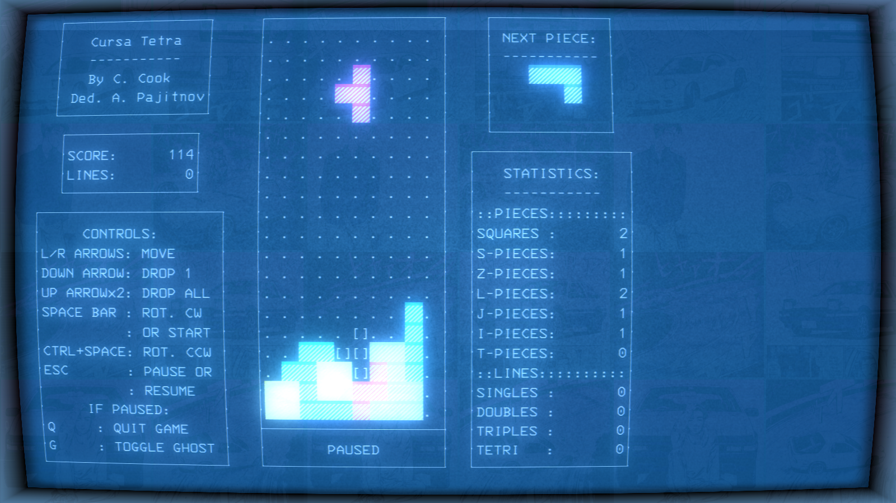

# CursaTetra

## A terminal-bounded block-based puzzle game written in Python/Curses

This game is dedicated to Alexey Pajitnov, original author of Tetris. This version features:
* 80x24 character resolution
* Colored pieces
* Nintendo-style scoring
* Three randomizer algorithms:
	* A 7-Bag piece randomizer
	* A random.randint() shuffle (a.k.a. "true") randomizer
	* A T.G.M.-inspired randomizer
* A "ghost piece" to help guide your aim
* A holding feature to save crucial pieces for when needed
* A high score file (JSON format)
* A settings file with preferred difficulty entries (JSON format)
* T-Spin detection and score reward
* The traditional 20-block high playing board

The goal is simple: rotate and move pieces as they fall, line up ten blocks in a row to clear a row, and keep going until the board tops out.

(Banner picture depicts the game running in Cool Retro Term, found [here](https://github.com/Swordfish90/cool-retro-term))

## How to run
* From the directory/folder where you have all the `.py` files, run `python cursatetra.py`


## Experimental Features
* Compatibility with `windows-curses` (Just needed extra entries in the cellValues dictionary because the color attributes are encoded differently in `windows-curses`)

## Bugs (Present)
* None that I can find (emphasis on that last part)

## Bugs (Fixed)
* *[Introduced after upgrading to Python 3.8]* Invoking the `undraw()` method on a piece, specifically during an invocation of `move()` on said piece, would cause the piece's color data to remain behind, causing the blank space to not register as such. This was game breaking. Was fixed by ensuring that a Curses `color_pair` is passed to the calls of `addch()` in the `drawPiece()` method. In particular, `color_pair` 0 is passed for when cells are to be made blank via invoking `undraw()`
* Disabling the ghost piece feature when the piece fully overlaps the ghost piece's position will delete (?) the piece. Fixed by making a default settings value such that the toggle key is disabled (can be re-enabled by editing `settings.json`

## Piece development documentation
### Piece orientations
* H : horizontal (default)
* V : vertical
* HP : horizontal, pi radians around (180 deg)
* VP : vertical, pi radians around (180 deg)
### class Piece: for active block data
* Valid Constructor Values:
	* y: [1, 19]
		* Smallest block height-wise is Square, S, and Z; All take up two cells vertically
	* x: [1, 10]
	* pID: {'C', 'S', 'Z', 'L', 'R', 'I', 'T'}
	* orient: {'', 'H', 'V', 'HP', 'VP'}
		* Null-orientation is only valid for the Square

* Methods & Valid Values:
	* draw(): Draws the piece on the board
	* undraw(): Erases the piece from the board
	* getGhostDepth(): Determines the y-position of the ghost piece
	* drawGhost(): Draws the ghost piece on the board
	* undrawGhost(): Erases the ghost piece from the board
	* getNewOrient(rotDir): Gets the new orientation for the piece based on rot. dir.
		* rotDir: {'CW', 'CCW'}
			* Clockwise or Counter-Clockwise
			* Only needed for L, R, and T pieces
	* rotate(rotDir): Rotates the piece in the indicated rot. dir.
		* rotDir: See notes in getNewOrient
	* move(direction): Moves the piece in the indicated direction
		* direction: {'L', 'R', 'D'}
			* Left, Right, or Down
	* canRotate(rotDir): Returns True if the piece can rotate in the indicated rot. dir.
		* rotDir: See notes in getNewOrient
	* canMove(direction): Returns True if the piece can move in the indicated direction
		* direction: See notes in move
### Piece designations & diagrams
#### Based on specification in Game Boy version
* Note: The orientation of the pieces may seem backwards at first glance;
Consider it in terms of the orientation of an underline
below the text character that identifies a piece

* C : Square
	* Diagram:
	```
	  012345
	0.[][]
	1.[][]
	2.
	```
* S : S-piece
	* Diagrams:
		* Horizontal
		```
		  012345
		0.
		1.  [][]
		2.[][]
		```
		* Vertical
		```
		  012345
		0.[]
		1.[][]
		2.  []
		```
	* Observations:
		* Rotates about (2:3, 1) Clockwise (???)
* Z : Z-piece
	* Diagrams:
		* Horizontal
		```
		  012345
		0.
		1.[][]
		2.  [][]
		```
		* Vertical
		```
		  012345
		0.  []
		1.[][]
		2.[]
		```
	* Observations:
		* Rotates about (2:3, 1) Clockwise (???)
* L : L-piece
	* Diagrams:
		* Horizontal
		```
		  012345
		0.  []
		1.  []
		2.  [][]
		```
		* Vertical
		```
		  012345
		0.
		1.[][][]
		2.[]
		```
		* Horizontal-Pi
		```
		  012345
		0.[][]
		1.  []
		2.  []
		```
		* Vertical-Pi
		```
		  012345
		0.    []
		1.[][][]
		2.
		```
	* Observations:
		* Rotates about (2:3, 1) Both Ways
* R : Reversed L-piece
	* Diagrams:
		* Horizontal
		```
		  012345
		0.  []
		1.  []
		2.[][]
		```
		* Vertical
		```
		  012345
		0.[]
		1.[][][]
		2.
		```
		* Horizontal-Pi
		```
		  012345
		0.  [][]
		1.  []
		2.  []
		```
		* Vertical-Pi
		```
		  012345
		0.
		1.[][][]
		2.    []
		```
	* Observations:
		* Rotates about (2:3, 1) Both Ways
* I : Line
	* Diagrams:
		* Horizontal
		```
		  01234567
		0.  []
		1.  []
		2.  []
		3.  []
		```
		* Vertical
		```
		  01234567
		0.
		1.
		2.[][][][]
		3.
		```
	* Observations:
		* Rotates about (2:3, 2) Clockwise (???)
* T : T-piece
	* Diagrams:
		* Horizontal
		```
		  012345
		0.
		1.[][][]
		2.  []
		```
		* Vertical
		```
		  012345
		0.  []
		1.[][]
		2.  []
		```
		* Horizontal-Pi
		```
		  012345
		0.  []
		1.[][][]
		2.
		```
		* Vertical-Pi
		```
		  012345
		0.  []
		1.  [][]
		2.  []
		```
	* Observations:
		* Rotates about (2:3, 1) Both Ways
